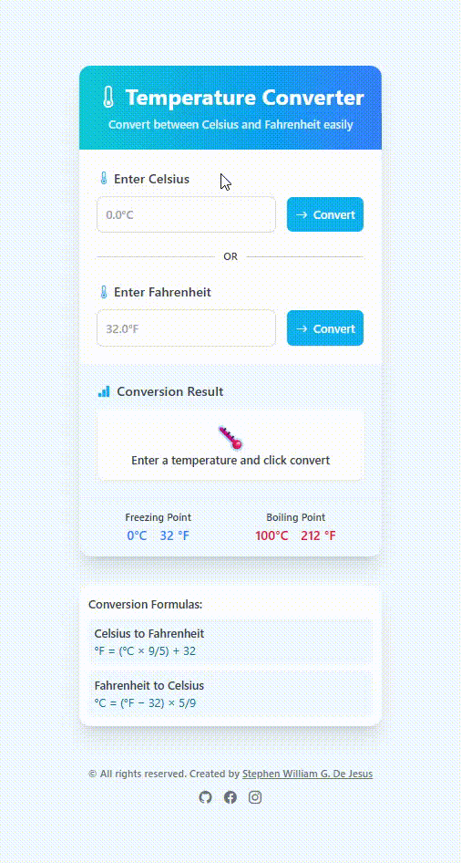
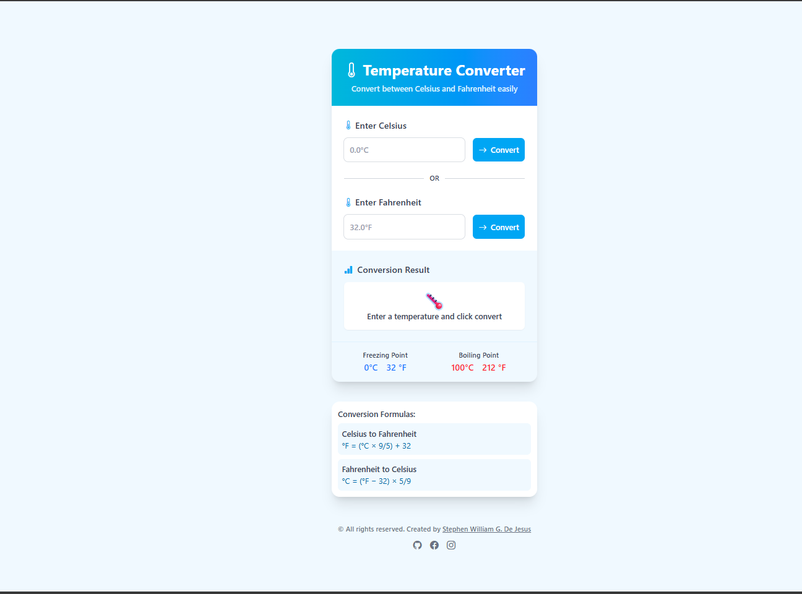

# 🌡️ Temperature Converter – JavaScript Web Application
A simple and accessible temperature conversion tool built with **HTML**, **Tailwind CSS**, and **JavaScript**.  
Convert between Celsius and Fahrenheit with instant results and educational reference points!

Crafted by **[Stephen William G. De Jesus](https://www.facebook.com/stephenwilliam.dejesus.5/)**, this project showcases responsive design, accessibility features, and clean vanilla JavaScript functionality.

---

## 📸 Preview  
### 🎞️ Live Interaction (GIF)  

### 🖼️ Application Screenshot  
 

---

## 🌐 Live Demo  
[View Live Demo](https://bogiiiie.github.io/03-javascript-temperature-converter/) 
---

## ✨ Features
- 🔄 **Bidirectional Conversion** – Celsius ↔ Fahrenheit  
- ⚡ **Instant Results** – Real-time conversion display  
- 📏 **Reference Points** – Freezing (0°C/32°F) and Boiling (100°C/212°F)  
- 🧮 **Formula Display** – Educational conversion formulas  
- ✅ **Input Validation** – User-friendly error messages  
- 📱 **Responsive Design** – Works on all devices  
- ♿ **Accessibility Ready** – Screen reader compatible  
- 🎨 **Clean UI** – Modern design with Tailwind CSS

---

## 🧮 Conversion Formulas
```
Celsius to Fahrenheit: °F = (°C × 9/5) + 32
Fahrenheit to Celsius: °C = (°F − 32) × 5/9
```

---

## 🚀 How to Use
1. **Enter Temperature** – Type a value in either Celsius or Fahrenheit field
2. **Click Convert** – Hit the convert button or press Enter
3. **View Result** – See instant conversion with visual feedback
4. **Reference Points** – Check freezing/boiling points for context
5. **Learn Formulas** – View the math behind each conversion

---

## 🛠️ Built With
- [HTML5](https://developer.mozilla.org/en-US/docs/Web/Guide/HTML/HTML5) – Semantic structure
- [Tailwind CSS](https://tailwindcss.com/) – Utility-first styling
- [JavaScript](https://developer.mozilla.org/en-US/docs/Web/JavaScript) – Conversion logic
- [Bootstrap Icons](https://icons.getbootstrap.com/) – UI icons
- [Font Awesome](https://fontawesome.com/) – Additional icons

---

## 📁 Project Structure
```
03-javascript-temperature-converter/
├── index.html          # Main HTML structure
├── script.js           # JavaScript functionality  
└── output.css          # Compiled Tailwind CSS
```

---

## 🚀 Getting Started
To run this project locally:

```bash
git clone https://github.com/bogiiiie/03-javascript-temperature-converter.git
cd 03-javascript-temperature-converter
open index.html
```

No build process required – just open `index.html` in your browser!

---

## 🎯 Key Functions
- **`celsiusToFahrenheit()`** – Converts °C to °F with precision
- **`fahrenheitToCelsius()`** – Converts °F to °C with precision  
- **`displayResult()`** – Updates UI with conversion results
- **`clearInputMessages()`** – Manages validation messages

---

## ♿ Accessibility Features
- 🏷️ **Semantic HTML** – Proper heading structure and landmarks
- 📢 **ARIA Labels** – Screen reader friendly descriptions
- ⌨️ **Keyboard Navigation** – Full keyboard accessibility
- 🎨 **High Contrast** – Readable color combinations
- 📱 **Responsive** – Works with screen magnification

---

## 📱 Responsive Design
- **Desktop** – Full-width card layout (max 450px)
- **Tablet** – Optimized spacing and touch targets
- **Mobile** – Stacked elements with mobile-friendly buttons

---

## 🔗 Connect with Me
- 💻 **GitHub**: [@bogiiiie](https://github.com/bogiiiie)
- 📘 **Facebook**: [Stephen William De Jesus](https://www.facebook.com/stephenwilliam.dejesus.5/)
- 📷 **Instagram**: [@stephenwilliamdejesus](https://www.instagram.com/stephenwilliamdejesus/)

---

## 👨‍💻 Author
Created by **[Stephen William G. De Jesus](https://www.facebook.com/stephenwilliam.dejesus.5/)**

---

## 📄 License
© 2024 All rights reserved. Created by Stephen William G. De Jesus.

---

## 🚀 Future Enhancements
- 🌡️ **Kelvin Scale** – Add third temperature scale
- 📊 **Conversion History** – Track previous conversions
- 🌙 **Dark Mode** – Toggle theme preference
- ⌨️ **Keyboard Shortcuts** – Quick conversion hotkeys
- 💾 **Save Preferences** – Remember user settings
